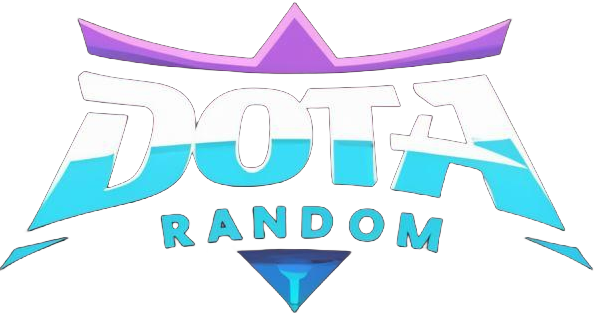

# Dota2 Fun Randomaizer

## Описание
Приложение Dota2Fun разработано для искушенных игроков игры Dota 2. Оно позволяет генерировать случайные предметы для героев, как для случайного героя, так и для выбранного пользователем.

Кроме того, приложение генерирует 👨‍🦽"zxc никнейм"👨‍🦽 - уникальный ник чтобы быть самым крутым в паблике, а так же мини-игра 🔮"Invoker Game"💫.

## Установка с Python
1. Скачайте и установите [Python](https://www.python.org/downloads/) (версия 3.6 или выше) на ваш компьютер, если его у вас еще нет.
2. Скачайте репозиторий 

## Приложение в одном файле

Вы можете скачать это приложение в `.exe` формате. Доступно во вкладке [realeses](https://github.com/hikkkaro/DotaFun/releases/tag/DotaFun)

**Скомпилированно с помощью python библиотеки [PyInstaller](https://pyinstaller.org/en/stable/)**

## Использование приложения
### С Python
1. Запустите командную строку или терминал и перейдите в папку проекта.
2. Для генерации случайных предметов для случайного героя, выполните команду:

   `python main.py`

   В результате появится окно с интерфейсом где вы можете использовать все функции.
### Как с Python так и для .exe файла
3. Для генерации случайного билда перейдите во вкладку "Build"

   Нажав на кнопку Generate будет создан случайный набор предметов, талантов и героя. Нажав на кнопку c тремя полосками вы можете выбрать героя для генерации и в результате на экран будет выведен список случайных предметов для данного героя.
4. Для генерации "zxc никнейма", перейдите во вкладку "Nickname". Также доступны дополнительные настройки генерации.

   В результате в строке вывода никнейма выведется случайно сгенерированный никнейм, который можно скопировать одной кнопкой.
5. Для игры нажмите на соответствующую вкладку "Invoker Game".

   Для старта игры нажмите на кнопку "Start Game" по середине экрана. Эта же кнопка используется для перезапуска игры. Так же можно осуществить запуск игры нажатием клавиши "Enter".
 

## Вклад
Если у вас есть предложения или замечания по улучшению приложения, пожалуйста, [создайте Issues](https://github.com/hikkkaro/DotaFun/issues) в данном репозитории.

Если вы хотите внести свой вклад в развитие проекта, пожалуйста, создайте [pull request](https://github.com/hikkkaro/DotaFun/pulls) с вашими изменениями.
